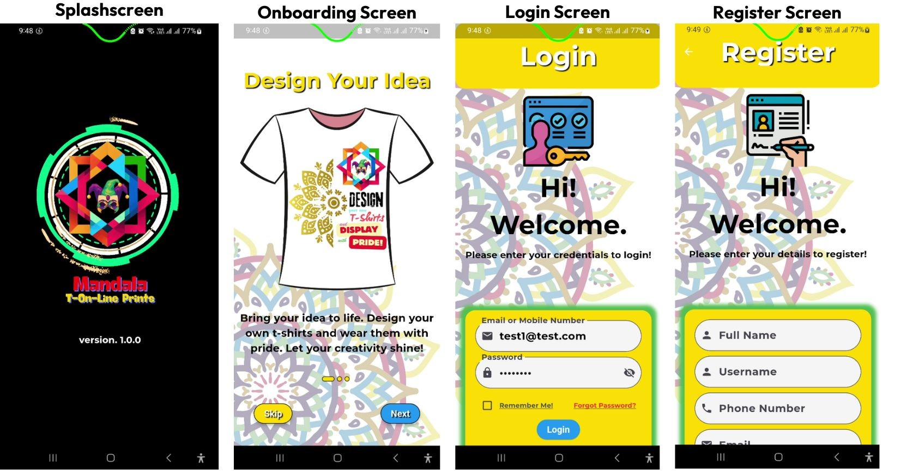
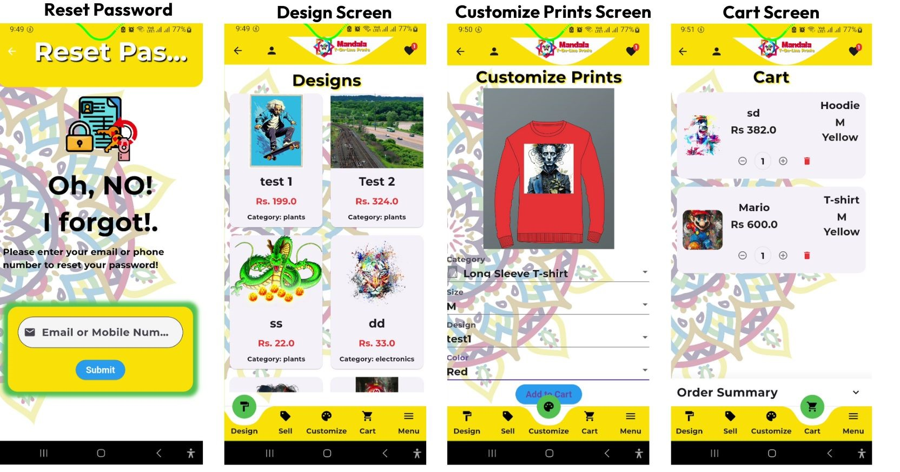
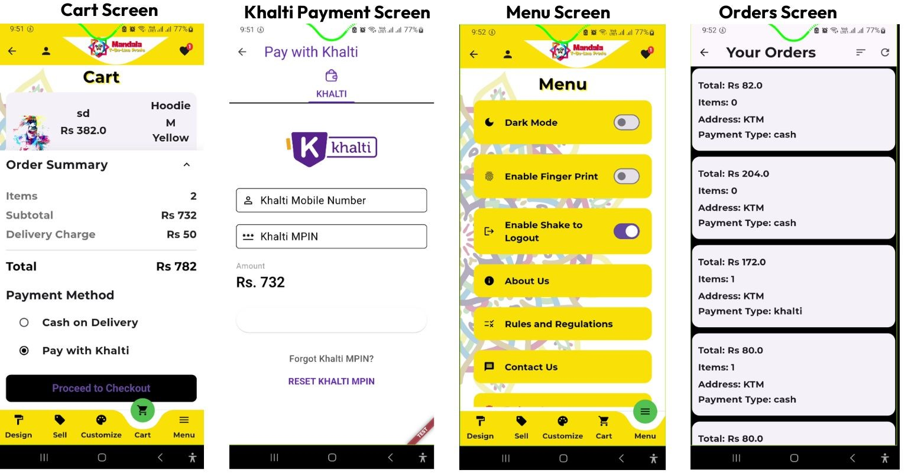
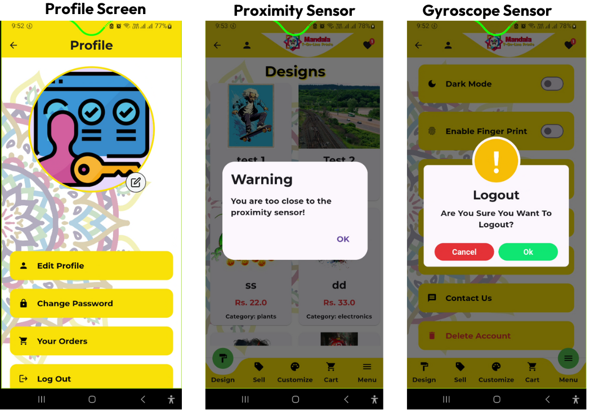

# Mandala T-On-Line Prints
**Mandala T-On-Line Prints**, a flutter-based frontend, is an innovative online platform based in Nepal, designed for the customization of prints on garments, with a primary focus on t-shirts, sweatshirts, and hoodies. The platform also serves as a marketplace where artists can showcase and sell their artwork printed on various wearable garments, catering to a diverse audience of art enthusiasts. Inspired by the beauty and intricacy of mandala art, "Mandala T-On-Line Prints" seeks to foster creativity and celebrate individual expression by offering customers unique and personalized clothing options that reflect their personality, ideas, and interests.

[Watch the Demonstration](https://youtube.com/licenses/mit/)

## Features
### User Role
**User Registration and Authentication:** Secure user registration and login functionality.

**Product Browsing and Search:** Users can browse available products and search for specific items.

**Customization Options:** Users can customize garments with various print options.

**Shopping Cart and Checkout:** A seamless shopping cart and checkout process.

**Secure Payment Integration:** Secure payment gateway for processing orders through Khalti or cash on delivery.

**Order Tracking and Management:** Users can track and manage their orders.

## Technologies
**MERN:** Backend API development framework.

**Flutter:** Core Frontend library

**MongoDB Cloud:** Database management.

**Khalti Payment Gateway:** Secure online payments.

**MVVM Design Pattern:** Ensures clean architecture and easy maintenance.

**API Integration**
** Riverpod State Management**

## Future Works
**Mobile Optimization:** Enhance responsiveness and usability on mobile devices.

**Multi-Language Support:** Add support for multiple languages to cater to a diverse user base.

**Advanced Analytics:** Integrate advanced analytics for artists and users to track engagement, sales, and trends.

**Live Chat Support:** Implement a live chat feature for users to communicate with customer support and artists.

## Challenges
**State Management:** Handling complex state logic across multiple user roles was challenging but manageable using Redux.

**API Integration:** Ensuring smooth and secure API communication, especially with sensitive data, required careful planning and testing.

**Responsive Design:** Maintaining a consistent and user-friendly interface across different screen sizes was challenging but achieved through React.

## Environment Variables
[REACT_APP_API_URL](https://github.com/st6003/backend-seca-ShadipKumarJoshi.git)

## Authors
### Shadip Kumar Joshi

## Appendix
### Previews

